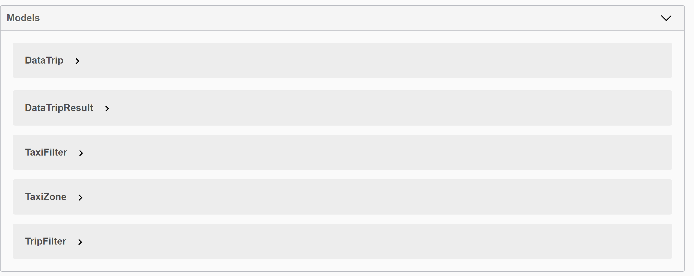

# TLC Trip Record Data API

- [TLC Trip Record Data API](#tlc-trip-record-data-api)
  - [Introduction](#introduction)
  - [Getting Started](#getting-started)
  - [Build and Test](#build-and-test)
    - [ASP .NET Core Web Application (REST API)](#asp-net-core-web-application-rest-api)
    - [Class Library .Net Core](#class-library-net-core)
    - [MSTest .NET Core](#mstest-net-core)
    - [Post Example Taxi Zone Search](#post-example-taxi-zone-search)
    - [Post Trips](#post-trips)
  - [Database Structure](#database-structure)
    - [Database connection](#database-connection)
    - [Data trip table](#data-trip-table)
    - [Taxi Zone table](#taxi-zone-table)
  - [TLC Dataset](#tlc-dataset)
    - [FHV dataset structure](#fhv-dataset-structure)
    - [Yellow dataset structure](#yellow-dataset-structure)
    - [Green dataset structure](#green-dataset-structure)
    - [Python ETL](#python-etl)
  - [Next](#next)
  - [Resources](#resources)

## Introduction

- Download
  - https://github.com/Fr4nc3/mta-fares-filter
- Live API Get
  - http://mta-tlc-demo-fr.azurewebsites.net/api/taxizone (example)
- Swagger Documentation
  - http://mta-tlc-demo-fr.azurewebsites.net/index.html
- Live UX usage
  - https://jsfiddle.net/fr4nc3/uocgxyjv/latest (underconstruction)

## Getting Started

1. Download Repository
2. Open Project with Visual Studio 2019
3. Run Local Rest API

## Build and Test

run from VS 2019: \


- Curl example

```bash
curl -X POST "https://localhost:5001/api/taxizone" -H  "accept: application/json" -H  "Content-Type: application/json" -d "{  \"limit\": 100,  \"pickup\": \"Brook\",  \"dropoff\": \"Brook\"}"
```

### ASP .NET Core Web Application (REST API)

- Rest APi created using Visual Studio 2019 Rest Template
- Libraries

  - Microsoft.EntityCore
  - Microsoft.EntityFrameworkCore
  - Microsoft.AspNetCore.Http
  - Pomelo.EntityFrameworkCore.MySql
  - Swashbuckle.AspNetCore

- One controller `TaxiTripController`
  - Get
    - `api/taxizone` get all taxi zones availablles
  - Post
    - `api/taxizone` get taxi zones using filter
    - `api/trips` get trips using filter and return database DAL structures
    - `api/tripsresults` get trips using filter and return tripresuls model
- Two DAL Models
  - `DataTrip`
  - `TaxiZone`
- Two Filters Model

  - `TripFilter`
  - `TaxiFilter`

- Swagger Documentation
  
- Swagger model Documentation
  

### Class Library .Net Core

A class library package to easily distribute, share, and reuse by other developers who want to implement the same functionality.


- Implemented Using the Swagger structure of the Rest API

### MSTest .NET Core

Test Project uses Class Library to test API structure

- Unittest connected to Azure server

```CSharp
    const string EndpointUrlString = "http://mta-tlc-demo-fr.azurewebsites.net/";
```

- Run Unitest


### Post Example Taxi Zone Search

- `api/taxizone`
- Body Payload Taxi Filter


```Json
{
    "search" : "Staten",
    "limit": 1000
}
```

- Response


```JSON
[
    {
        "locationId": 5,
        "boroughName": "Staten Island",
        "zone": "Arden Heights",
        "serviceZone": "Boro Zone"
    },
    {
        "locationId": 6,
        "boroughName": "Staten Island",
        "zone": "Arrochar/Fort Wadsworth",
        "serviceZone": "Boro Zone"
    }
]
```

### Post Trips

- `api/tripsresults`
- Body Payload Trip Filter


```Json
{
  "limit": 100,
  "pickup": "brook",
  "dropoff": "brook",
  "carType": "green",
  "startDate": "2018-01-03",
  "endDate": "2018-01-03"
}
```

- Response


```JSON
[
    {
        "carType": "green",
        "pickupBorough": "Downtown Brooklyn/MetroTech",
        "dropoffBorough": "Downtown Brooklyn/MetroTech",
        "pickUpTime": "2018-01-01T00:12:30",
        "droppOffTime": "2018-01-01T00:17:05",
        "fareAmount": 4.500,
        "passengerCount": 1,
        "payType": "Cash",
        "rateCode": "StandardRate",
        "tripDistance": 0.250,
        "timeLapse": 4.583333333333333
    },
    {
        "carType": "green",
        "pickupBorough": "Downtown Brooklyn/MetroTech",
        "dropoffBorough": "Downtown Brooklyn/MetroTech",
        "pickUpTime": "2018-01-01T00:13:12",
        "droppOffTime": "2018-01-01T00:18:21",
        "fareAmount": 5.500,
        "passengerCount": 1,
        "payType": "Cash",
        "rateCode": "StandardRate",
        "tripDistance": 0.720,
        "timeLapse": 5.15
    }
]
```

## Database Structure

### Database connection

```JSON
  "ConnectionStrings": {
    "DefaultConnection": "server=fr4nc3.com; port=3306; database=frfounct_mta_demo; user=frfounct_mta_demo; password=mta.demo.2021; Persist Security Info=False; Connect Timeout=300"
  }
```

### Data trip table

```SQL
CREATE TABLE `data_trip` (
  `trip_id` varchar(36) COLLATE utf8mb4_unicode_ci NOT NULL,
  `car_type` varchar(36) COLLATE utf8mb4_unicode_ci NOT NULL,
  `pickup_borough` int(10) NOT NULL DEFAULT '265',
  `dropoff_borough` int(10) NOT NULL DEFAULT '265',
  `rate_code_id` int(10) NOT NULL DEFAULT '1',
  `fare_amount` decimal(10,3) NOT NULL DEFAULT '0.000',
  `passenger_count` int(10) NOT NULL DEFAULT '1',
  `sr_flag` int(10) NOT NULL DEFAULT '0',
  `pay_type` int(10) NOT NULL DEFAULT '0',
  `trip_distance` decimal(10,3) NOT NULL DEFAULT '0.000',
  `start_date` datetime NOT NULL,
  `end_date` datetime NOT NULL,
  PRIMARY KEY (`trip_id`),
  UNIQUE KEY `trip_id_UNIQUE` (`trip_id`),
  KEY `trip_id` (`trip_id`),
  KEY `pickup_brough` (`pickup_borough`),
  KEY `dropoff_borough` (`dropoff_borough`),
  CONSTRAINT `data_trip_ibfk_1` FOREIGN KEY (`pickup_borough`) REFERENCES `taxi_zone` (`location_id`),
  CONSTRAINT `data_trip_ibfk_2` FOREIGN KEY (`dropoff_borough`) REFERENCES `taxi_zone` (`location_id`)
) ENGINE=InnoDB DEFAULT CHARSET=utf8mb4 COLLATE=utf8mb4_unicode_ci;
```

### Taxi Zone table

```SQL
CREATE TABLE `taxi_zone` (
  `location_id` int(10) NOT NULL,
  `borough_name` varchar(13) DEFAULT NULL,
  `zone` varchar(45) DEFAULT NULL,
  `service_zone` varchar(12) DEFAULT NULL,
  PRIMARY KEY (`location_id`),
  KEY `br_name_idx` (`borough_name`),
  FULLTEXT KEY `z_full_search` (`zone`),
  FULLTEXT KEY `service_zone` (`service_zone`),
  FULLTEXT KEY `borough_name` (`borough_name`)
) ENGINE=InnoDB DEFAULT CHARSET=utf8;
```

## TLC Dataset

### FHV dataset structure

Description: \


### Yellow dataset structure

Description: \


### Green dataset structure

Description: \


### Python ETL

- Sql insert example

```SQL
INSERT INTO data_trip (trip_id,car_type,pickup_borough,dropoff_borough,rate_code_id,fare_amount,passenger_count,sr_flag,pay_type,trip_distance,start_date, end_date) VALUES ("3b1b88b4-6f24-11eb-9846-acde48001122","green","43","42","1","14.5","5","0", "2","3.50","2018-01-01 00:30:26", "2018-01-01 00:46:42");
INSERT INTO data_trip (trip_id,car_type,pickup_borough,dropoff_borough,rate_code_id,fare_amount,passenger_count,sr_flag,pay_type,trip_distance,start_date, end_date) VALUES ("3b1b8968-6f24-11eb-9846-acde48001122","green","74","152","1","10","1","0", "2","2.14","2018-01-01 00:07:25", "2018-01-01 00:19:45");

```

```python
sql_insert = "INSERT INTO data_trip (" \
            "trip_id,car_type,pickup_borough,dropoff_borough,rate_code_id,fare_amount,passenger_count,sr_flag," \
            "pay_type,trip_distance,start_date, end_date) " \
            "VALUES ({},{},{},{},{},{}," \
            "{},{}, {},{},{}, {});\n"
```

- FHV to datatrip table

```Python
import db
import uuid

sql_file = 'sql/fhv_2018_01.sql'
sql_writer = open(sql_file, "w+")
count = 0
car_type = '"{}"'.format('fhv')
with open('csv/fhv_tripdata_2018-01.csv', 'r') as f:
    for line in f:
        line = line.strip()
        x = line.split(',')
        trip_id = '"{}"'.format(uuid.uuid1())  # unique id for the trip
        pickup_borough = x[3] if x[3] != '""' else '"{}"'.format(265)
        dropoff_borough = x[4] if x[4] != '""' else '"{}"'.format(265)
        rate_code_id = '"{}"'.format(1)  # default
        fare_amount = '"{}"'.format(0.000)  # default
        passenger_count = '"{}"'.format(1)  # default
        sr_flag = x[5] if x[5] != '""' else '"{}"'.format(0)
        pay_type = '"{}"'.format(5)  # unknown
        trip_distance = '"{}"'.format(0.000)  # default
        start_date = x[1]
        end_date = x[2]
        if 1 < count:  # avoid header
            sql_writer.write(db.sql_insert.format(trip_id, car_type, pickup_borough, dropoff_borough,
                                                  rate_code_id, fare_amount, passenger_count, sr_flag,
                                                  pay_type, trip_distance, start_date, end_date))

        count += 1

```

Description: \


- Yellow datase to datatrip table

```python
import db
import uuid

sql_file = 'sql/yellow_2018_01.sql'
sql_writer = open(sql_file, "w+")
count = 0
car_type = '"{}"'.format('yellow')
with open('csv/yellow_tripdata_2018-01.csv', 'r') as f:
    for line in f:
        line = line.strip()
        x = line.split(',')
        if len(x) < 10:  # if the line doesn't match the array structure
            continue
        trip_id = '"{}"'.format(uuid.uuid1())  # unique id for the trip
        pickup_borough = '"{}"'.format(x[7]) if x[7] != '' else '"{}"'.format(265)
        dropoff_borough = '"{}"'.format(x[8]) if x[8] != '' else '"{}"'.format(265)
        rate_code_id = '"{}"'.format(x[5])
        fare_amount = '"{}"'.format(x[10])
        passenger_count = '"{}"'.format(x[3])
        sr_flag = '"{}"'.format(0)
        pay_type = '"{}"'.format(x[9])
        trip_distance = '"{}"'.format(x[4])
        start_date = '"{}"'.format(x[1])
        end_date = '"{}"'.format(x[2])
        if 1 < count:  # avoid header sample
            sql_writer.write(db.sql_insert.format(trip_id, car_type, pickup_borough, dropoff_borough,
                                                  rate_code_id, fare_amount, passenger_count, sr_flag,
                                                  pay_type, trip_distance, start_date, end_date))

        count += 1

```

- Green dataset to datatrip table

```python
import db
import uuid

sql_file = 'sql/green_2018_01.sql'
sql_writer = open(sql_file, "w+")
count = 0
car_type = '"{}"'.format('green')
with open('csv/green_tripdata_2018-01.csv', 'r') as f:
    for line in f:
        line = line.strip()
        x = line.split(',')
        if len(x) < 18:  # if the line doesn't match the array structure
            continue
        trip_id = '"{}"'.format(uuid.uuid1())  # unique id for the trip
        pickup_borough = '"{}"'.format(x[5]) if x[5] != '' else '"{}"'.format(265)
        dropoff_borough = '"{}"'.format(x[6]) if x[6] != '' else '"{}"'.format(265)
        rate_code_id = '"{}"'.format(x[4])
        fare_amount = '"{}"'.format(x[9])
        passenger_count = '"{}"'.format(x[7])
        sr_flag = '"{}"'.format(0)
        pay_type = '"{}"'.format(x[17])
        trip_distance = '"{}"'.format(x[8])
        start_date = '"{}"'.format(x[1])
        end_date = '"{}"'.format(x[2])
        if 1 < count:  # avoid header sample
            sql_writer.write(db.sql_insert.format(trip_id, car_type, pickup_borough, dropoff_borough,
                                                  rate_code_id, fare_amount, passenger_count, sr_flag,
                                                  pay_type, trip_distance, start_date, end_date))

        count += 1

```

## Next

- Cache database queries
- improve table indexes
- add new filters
- Remove hardocode MySQL connection
- Add MySql Connection by environment
- Better API names?
- Load More Data

## Resources

TODO: Explain how other users and developers can contribute to make your code better.

If you want to learn more about creating good readme files then refer the following [guidelines](https://docs.microsoft.com/en-us/azure/devops/repos/git/create-a-readme?view=azure-devops). You can also seek inspiration from the below readme files:

- [ASP.NET Core](https://github.com/aspnet/Home)
- [Visual Studio Code](https://github.com/Microsoft/vscode)
- [Chakra Core](https://github.com/Microsoft/ChakraCore)
